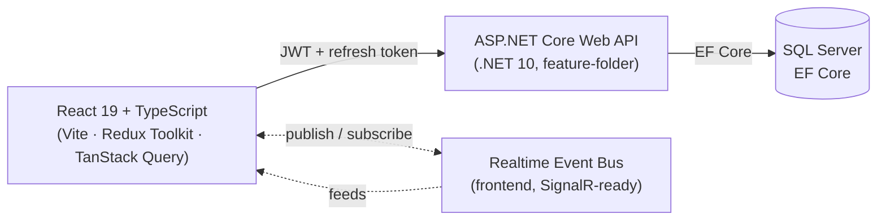

<div align="center">

# MyAdmin

**A full-stack enterprise admin console — granular RBAC, audit logging, and a live activity feed, built on a .NET Web API and a React 19 dashboard.**

[](Api)
[](Api)
[](Api)
[](Api/Data)
[](client)
[](client)
[](client)

</div>

---

## Table of Contents

1. [Overview](#overview)
2. [Key Features](#key-features)
3. [Full-Stack Architecture](#full-stack-architecture)
4. [System Architecture Diagram](#system-architecture-diagram)
5. [RBAC Permission Matrix](#rbac-permission-matrix)
6. [Real-Time & Observability Approach](#real-time--observability-approach)
7. [Project Structure](#project-structure)
8. [Getting Started](#getting-started)
9. [Environment Variables](#environment-variables)
10. [Running the Frontend](#running-the-frontend)
11. [Running the Backend](#running-the-backend)
12. [Build & Type-Check Commands](#build--type-check-commands)
13. [Screenshots](#screenshots)
14. [Demo](#demo)
15. [Roadmap](#roadmap)
16. [License](#license)

---

## Overview

MyAdmin is a feature-folder .NET Web API paired with a Vite/React 19 admin panel. It implements a
complete Role/Permission/RolePermission/UserRole authorization model (Admin / Editor / Viewer), JWT +
refresh-token authentication, and an audit trail for every mutating action — with a UI that never lets a
disabled button surprise the user about *why* it's disabled.

A built-in **Instant Demo** mode lets anyone explore the full panel under any of the three roles without
creating an account — useful for reviewing the RBAC behavior described below without standing up a
database first.

## Key Features

- **Granular RBAC** — permission checks live in a single hook (`useRolePermissions`) and are enforced at
  the component level: every mutating button knows whether it's allowed, and tells the user why when it
  isn't.
- **Audit Logging** — every mutation (invite, delete, status toggle, role sync, role creation, settings
  change) is recorded with actor, entity, and before/after values.
- **Real-Time Activity Feed** — a frontend event bus fans mutation events out to the dashboard and the
  audit log simultaneously, without a full page reload.
- **Instant Demo Mode** — a floating role switcher lets visitors experience Admin / Editor / Viewer
  permission boundaries immediately from the landing page.
- **Command Palette** — `Ctrl+K` / `Cmd+K` fuzzy navigation across the whole panel.
- **URL-synced state** — search, filters, and pagination live in `searchParams`, debounced, so views are
  shareable and back-button-safe.
- **Dark / light theme** — persisted, system-aware, applied consistently across the public site and the
  dashboard.

## Full-Stack Architecture

| Layer | Technology |
| --- | --- |
| API | ASP.NET Core Web API (.NET 10), feature-folder structure (`Api/Features/*`) |
| Data | Entity Framework Core over SQL Server, code-first migrations, seeded roles/permissions |
| Auth | JWT (HMAC-SHA512) access tokens + refresh-token rotation |
| Validation | FluentValidation |
| Mapping | Mapperly (compile-time DTO mapping) |
| Logging | Serilog (console + rolling file sink) |
| Client state | Redux Toolkit (auth session, live activity feed) |
| Server state | TanStack Query (caching, optimistic mutations, rollback) |
| UI | Tailwind CSS v4 + Radix UI primitives + shadcn/ui conventions |

## System Architecture Diagram



> The realtime layer runs entirely in the frontend today (see
> [Real-Time & Observability Approach](#real-time--observability-approach)) and is designed to be swapped
> for a genuine SignalR hub without changing its subscribe/publish contract — see [Roadmap](#roadmap).

## RBAC Permission Matrix

Roles are fixed (`Admin` / `Editor` / `Viewer`, seeded in `Api/Data/SeedData.cs`). The frontend enforces
the same matrix at the component level via `useRolePermissions`:

| Action           | Admin | Editor | Viewer |
| ---------------- | ----: | -----: | -----: |
| Invite User      |   Yes |    Yes |     No |
| Toggle Status    |   Yes |    Yes |     No |
| Delete User      |   Yes |     No |     No |
| Sync Role        |   Yes |     No |     No |
| New Role         |   Yes |     No |     No |
| View Dashboard   |   Yes |    Yes |    Yes |
| View Audit Logs  |   Yes |    Yes |    Yes |

Disabled buttons always carry a tooltip explaining the required role, rather than disappearing silently.

## Real-Time & Observability Approach

Mutations (invite, delete, status toggle, role sync, role creation, settings updates) publish to a
type-safe, in-process **event bus** (`core/realtime/realtimeEventBus.ts`). A single bridge component
(`RealtimeBridge`) subscribes once and fans each event out to:

- the Redux `activityFeed` slice, powering the dashboard's live activity widget, and
- the TanStack Query `["activities"]` cache, so the Audit Log and dashboard charts update instantly —
  no refetch, no full page reload.

Each event carries a simulated `responseTimeMs`, `correlationId`, and indexing flag, and the Audit Log
detail view renders these as observability badges (`Elasticsearch Indexed`, `Response Time: Nms`,
`SignalR`, correlation ID) to preview what a production observability stack would surface. The bus's
`subscribe`/`publish` contract is the intended integration point for a real SignalR hub later — see
[Roadmap](#roadmap).

## Project Structure

```
MyAdmin/
├─ Api/                     # ASP.NET Core Web API (.NET 10)
│  ├─ Core/                 # Cross-cutting: security, middleware
│  ├─ Data/                 # DbContext, seed data, migrations
│  └─ Features/             # Feature folders: Users, Roles, Permissions,
│                            #   RolePermissions, UserRoles, Activities,
│                            #   Notifications, Authentication
└─ client/                  # React 19 + Vite admin panel
   └─ src/
      ├─ core/              # apiClient, hooks, realtime bus, shared UI
      ├─ features/          # users, roles, permissions, activities,
      │                     #   dashboard, settings, landing, auth
      ├─ layouts/            # DashboardLayout, PublicLayout
      └─ providers/          # AppProvider (Redux, Query, Theme, Toasts)
```

## Getting Started

**Prerequisites**

- Node.js 20+ and npm
- .NET 10 SDK
- SQL Server (or LocalDB on Windows)

## Environment Variables

**`Api/appsettings.Development.json`** (not committed — create locally):

```json
{
  "ConnectionStrings": {
    "SqlConnection": "Server=(localdb)\\MSSQLLocalDB;Database=MyAdmin;Trusted_Connection=True;TrustServerCertificate=True"
  },
  "TokenOptions": {
    "Audience": "www.myadmin.com",
    "Issuer": "www.myadmin.com",
    "AccessTokenExpiration": 30,
    "RefreshTokenExpiration": 7,
    "SecurityKey": "<a random string, at least 64 bytes, for HMAC-SHA512>"
  }
}
```

**`client/.env.local`** (optional — defaults to `http://localhost:5029/api`):

```
VITE_API_URL=http://localhost:5029/api
```

## Running the Frontend

```bash
cd client
npm install
npm run dev      # http://localhost:3000
```

## Running the Backend

```bash
cd Api
dotnet restore
dotnet ef database update   # applies migrations
dotnet run                  # see Properties/launchSettings.json for ports
```

## Build & Type-Check Commands

```bash
cd client
npx tsc -b --noEmit   # type-check
npm run lint          # ESLint
npm run build         # tsc -b && vite build
```

```bash
cd Api
dotnet build
```

## Screenshots

<!-- Add dashboard screenshot here -->

<!-- Add roles & permissions screenshot here -->

<!-- Add audit log screenshot here -->

## Demo

<!-- Add product demo GIF here -->

Until then, use **Instant Demo** on the landing page to explore Admin / Editor / Viewer sessions live.

## Roadmap

- [x] Granular, component-level RBAC with explained disabled states
- [x] Frontend real-time event bus with a SignalR-shaped subscribe/publish contract
- [x] Command palette, URL-synced filters, optimistic mutations
- [ ] Real SignalR hub replacing the simulated event bus
- [ ] Elasticsearch-backed audit log search and indexing
- [ ] Redis-backed distributed cache for hot read paths
- [ ] Optional PostgreSQL provider alongside SQL Server

## License

No license has been declared yet for this repository. Until one is added, all rights are reserved by the
project author.
